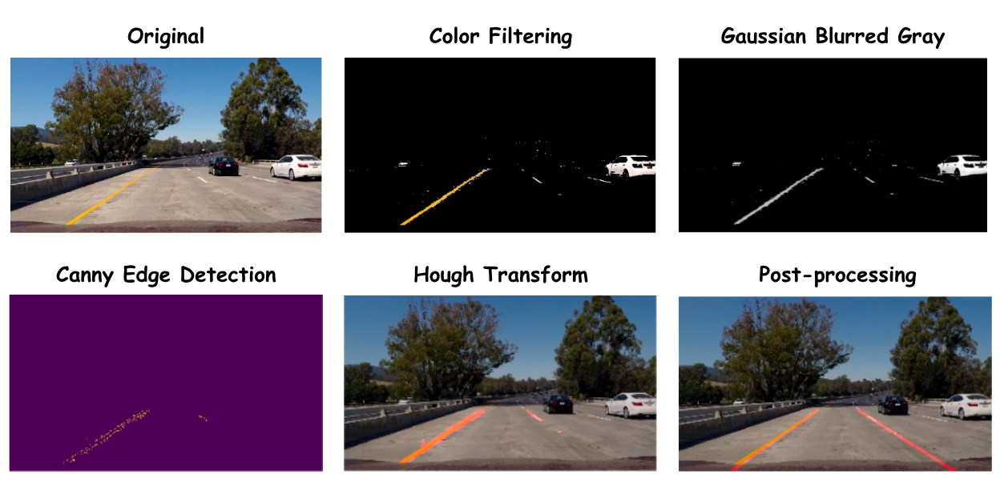
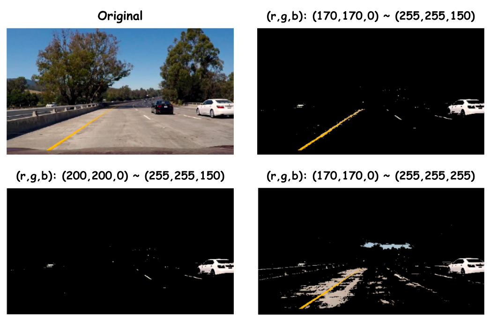

# **Finding Lane Lines on the Road** 

## Reflection

### I. Pipeline

My pipeline consists of 8 steps. Some important steps are shown in below figure.  

**Fig1. Pipeline**

#### 1. pre-processing
Filter out unneccessary colors and leave only lane colors, .i.e. yellow and white.  

#### 2. convert to gray-scale
Convert the image to gray-scale so that we can perform Canny edge detection on it later.  

#### 3. Gaussian blurring
Apply Gaussian blurring on the gray-scale image to smooth the edge of objects in the image.  

#### 4. Canny edge detection
Perform Canny edge detection on the smoothed image.  

#### 5. ROI region
Mask out regions outside ROI.  

#### 6. Hough transform
Apply Hough transform to obtain potential line segments belongs to the edge of lane.  

#### 7. post-processing
The method of drawing two clear lanes directly from raw line segments obtained in step6. isn't trivial. As a result, some post-processing steps are required. 

###### a. Split Left/Right Lanes:
Split all line segments into either left or right group according to whether they locate at left or right side of the image. To be noticed, step c/d would result in a single slope-intercept pair for each group.  

###### b. Slope Filtering
Filter out line segments with slope outside [tan(30), tan(60)] for right lines and [tan(-60), tan(-30)].  

###### c. LSE-fitting
Fit a straight line through all endpoints on line segments using least-square-error for left and right group respectively.  

###### d. Average Slope/Intercept
Average the slope and intercept of line segments using their length to be weights.  

#### 8. create lane lines
Use the slope/intercept obtained in either *step 7.d* or *step 7.c* to draw the two post-processed lane lines on original image.  

---
### II. Discussion
Here we discuss steps which are significant to performance or conditionally correct.

#### 1. Color filtering
To choose the adequate RGB range for the filter, I use the mac built-in digital color meter app to detect the desired color from lane in image (shown in Fig2.). And the RGB-cube in Fig2. serves as a guide of the distribution of various color in the RGB color space. This step is very significant to the overall performance.  

![rgb cube] (./misc/rgb_guide.png)
**Fig2. Digital color meter / RGB cube**

**Fig3. Tuning color filter**

#### 2. Split left/right lane
Since the assignment of line segments to left/right lane is according to its location, we equivalently add a hypothesis that our car was located in the middle of the lane and drove along it. This may not be case in some scenario such as switching lane.  

#### 3. Slope filtering
Filtering orientation of line segments between 30 ~ 60 degree also results in a hypothesis of final line orientation for average-slope/intercept (*step 7.d*) method. Similar to lane-splitting discussion above, this hypothesis may be violated in some circumstances. For example, when the orientation of the car is not along the lane or when the curvature of the lane is too large.  

#### 4. LSE-fitting v.s. Average-Slope/Intercept
The two method has roughly the same complexity when we use np.polyfit with degree 1 for LSE-fitting. These methods perform well against noisy segments in different situations. LSE-fitting could bear relatively long line segment noise as long as the number of false positive line segments are not dominating. Worth noticing, these methods also hypothesize that the lane is a straight line.

---

### III. Potential shortcomings

The major drawback of this pipeline is the difficulties of both hyper-parameter tuning and generalization into various realworld cases. I'll address it in 3 aspects below.

#### 1. Noise in color
The noise affecting color in reality includes light, and tree shade. All those effect could make the presence of yellow and white lanes ambiguous. Specifically, the yellow lane is hard to distinguish from gray in some cases, since yellow with high saturation or brightness is very similar to bright gray in color space. 

#### 2. Noise in edges
Objects in the scene could somehow break the shape of lane. Direct occulation might completely eliminate vision of lanes. Even objects near lanes would result in noise when we tried to summarize line segments into two main lane lines using either "average slope/intercept" or "LSE fitting".

#### 3. Unrealistic hypothesis
We already discussed that the hypothesis summarized in the II.2 ~ II.4 would not hold in many situations in real world. In such cases, our detected lane could deviate greatly from the real lane. 

---

### IV. Future improvements

#### 1. More advanced fitting method
One direct improvement is to increase the degree of fitting model to enable polynomial fitting. This complex model could better fit curve.

#### 2. Additional features
Some of the drawbacks or problems described above cannot be solved easily by improving the pipeline with more advanced method. For example, complete occulation or poor light condition could make the lane undetectable by  our pipeline, since lane itself is completely out of sight. To overcome this problem, we can add additional features such as vanish point, horizon, and parallel lines. Observing orientation of horizon results in a much more precise prior of the lane orientation. Such prior could be easily integrated into our model using the slope filtering method described in I.7.b.

#### 3. Improved hypothesis
With the advanced fitting model and additional features, we can modify hypothesis in II.2 ~ II.4 to be more realistic. For instance, splitting left/right according to road orientation rather than pixel coordinates or fitting a curved lane.